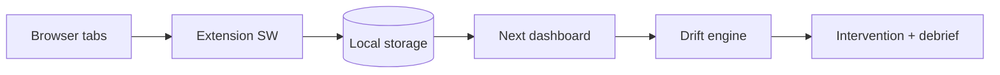

# Architecture

## Target shape (monorepo-friendly)

```
breakpoint/              # Next.js app (current repo layout)
docs/                    # Product contract (this folder’s siblings live at repo root)
extension/               # Chrome MV3 (future): service worker + optional popup
packages/shared/         # Optional: shared types + drift engine for app + extension
```

The **current** codebase keeps types and drift logic inside the Next app; extracting `packages/shared` is a small move when the extension lands.

## Runtime pieces

| Piece | Role |
|-------|------|
| **Dashboard (Next.js)** | Session UI, debrief, visualization, optional API routes for Claude |
| **Extension (future)** | Subscribe to `tabs`, `webNavigation`; emit normalized `BreakpointEvent`s |
| **Drift engine** | Pure functions over events → scores and intervention hints |
| **Storage** | MVP: `localStorage`. Extension: `chrome.storage.local` + message passing |

## Event flow (target)



For the **MVP without extension**, the dashboard writes the same event shape via dev buttons.

## Claude

- **Not** on the hot path for detection.
- **Use** for debrief narrative, summarizing a tab set, or classifying ambiguous pages when the user asks or when a threshold is hit (rate-limited).

## Design choices

- Local-first, minimal permissions story for the extension when added.
- Manifest V3 service worker as the single owner of tab subscriptions.
- One canonical `BreakpointEvent` type shared by app and extension (future package or duplicated until merge).
